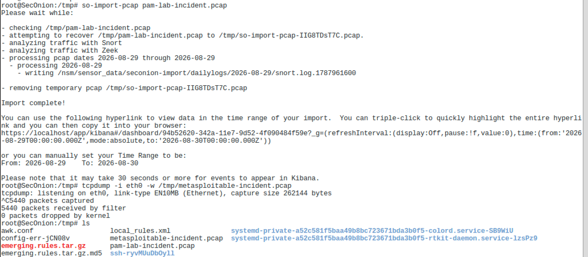
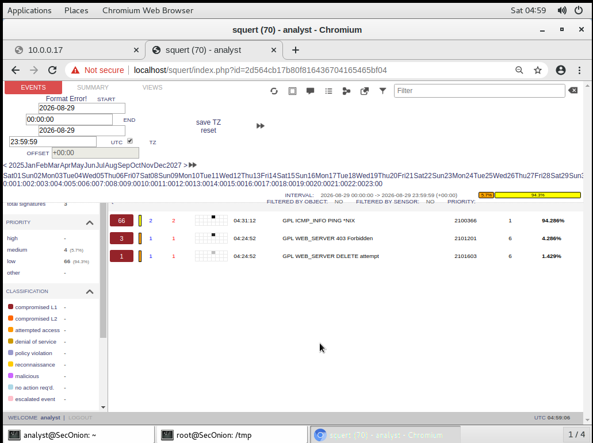
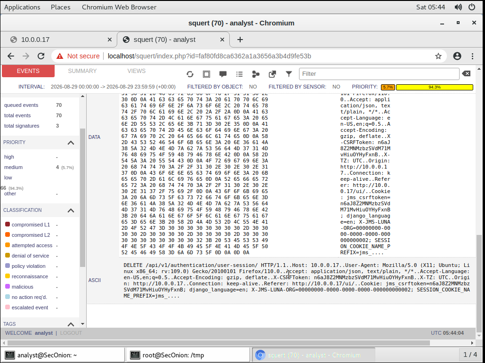
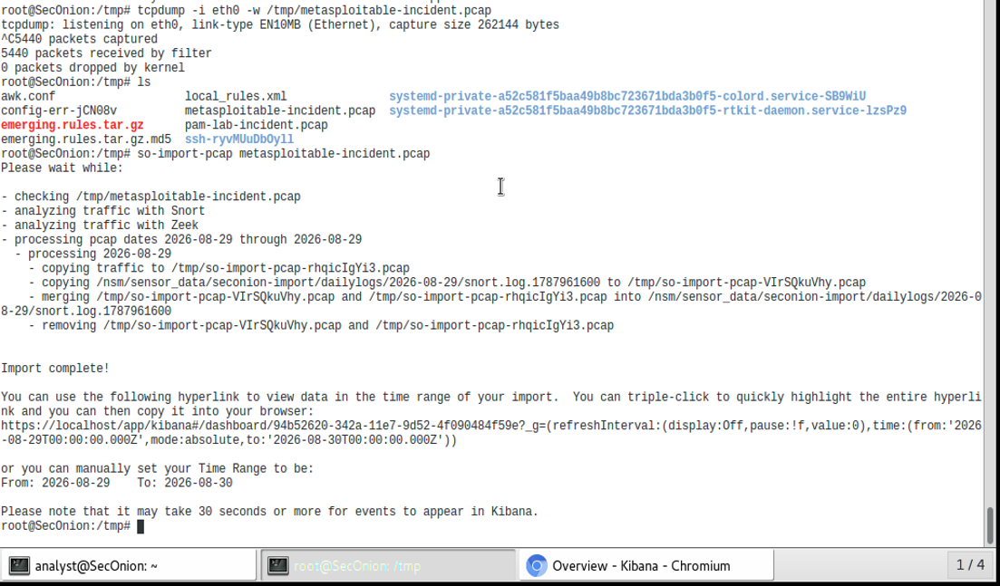
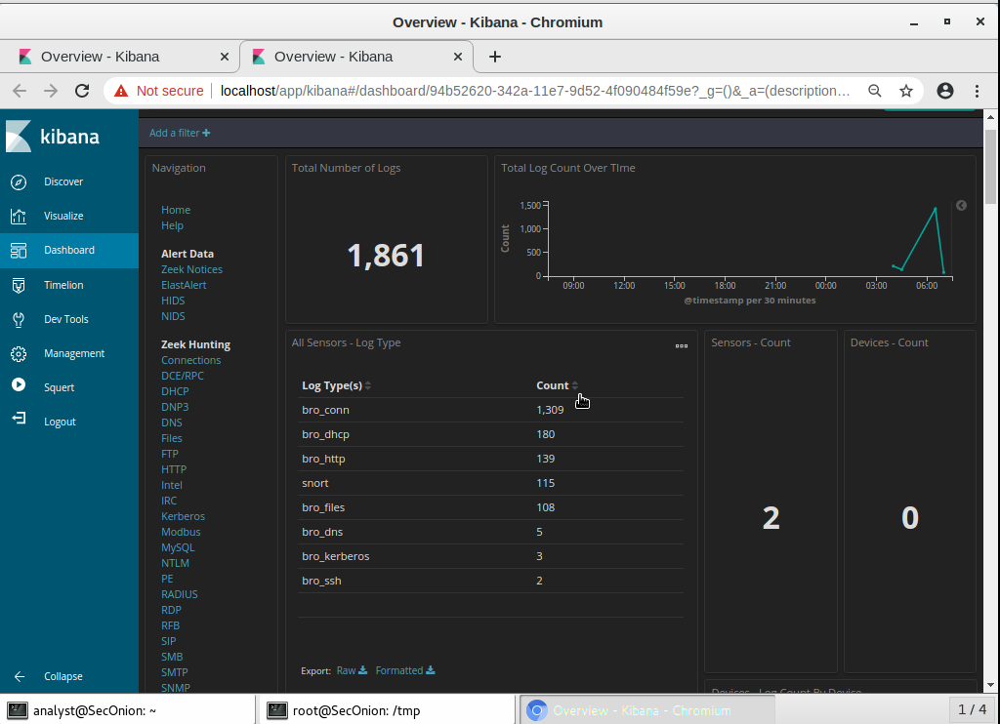
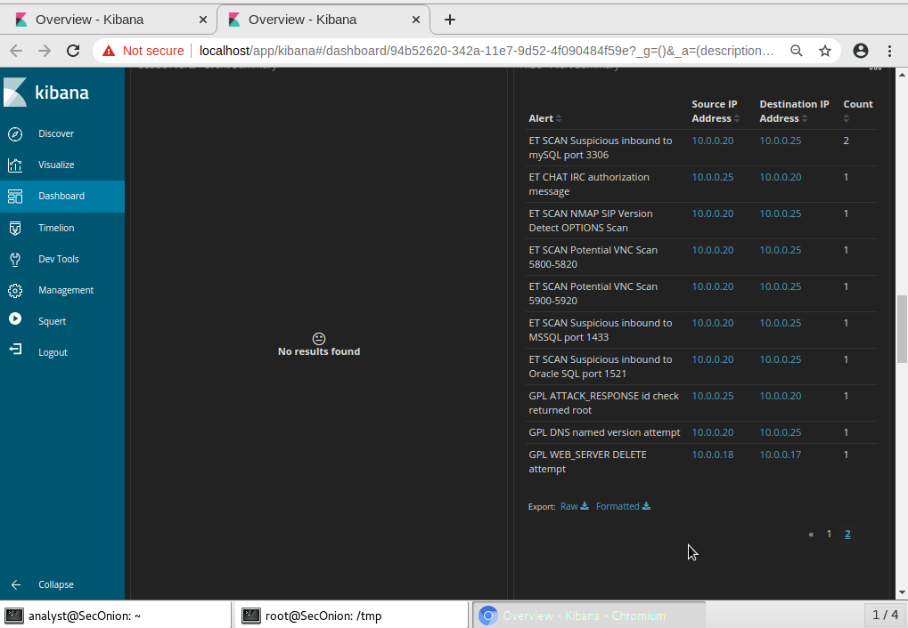
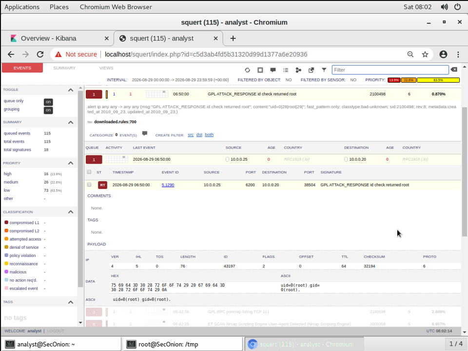

# Incident Analysis Report - PAM Enforcement Validation & Offensive Simulation Detection

| | |
|---|---|
| **Analyst** | Amr Ahmed Mohamed Abdeldayem |
| **Program** | CyberOps Associate Internship - Cisco NetAcad |
| **Environment** | Isolated lab segment `10.0.0.0/24` ("pam-lab") |
| **Sensor** | Security Onion (Zeek + Snort), triaged via Squert / Kibana |
| **Report date** | 2026-08-29 |

---

## 1. Executive Summary

Two independent scenarios were exercised on the same monitored network segment to demonstrate both preventive and detective SOC controls:

1. **PAM Enforcement Validation** - a JumpServer bastion host (8-container stack, deployed from scratch) was built to broker privileged access to a managed Linux host, with an active command-filtering policy (`rm`, `rm -rf`, `sudo su`, `sudo -i`, `dd if=`, `mkfs`). All six commands were rejected in real time when attempted through the bastion.
2. **Offensive Simulation & Detection** - a minimal, real kill chain (reconnaissance → exploitation) was run from a Kali attacker host against a deliberately vulnerable Metasploitable2 target, resulting in a confirmed root-level compromise via the vsftpd 2.3.4 backdoor.

Across both scenarios, Security Onion logged **1,861 total events**, including **115 Snort NIDS alerts across 18 distinct signatures**. Two alerts were selected for full payload-level triage as representative cases:

| Case | Signature | Verdict |
|------|-----------|---------|
| A | `GPL WEB_SERVER DELETE attempt` | 🟡 **False Positive** - benign JumpServer REST API traffic |
| B | `GPL ATTACK_RESPONSE id check returned root` | 🔴 **True Positive** - confirmed root compromise |

Both verdicts were reached by reading raw payload evidence, not by trusting the alert name alone - the core discipline this PoC set out to demonstrate.

---

## 2. Scope & Environment

```
                         PAM-LAB SEGMENT — 10.0.0.0/24
   ┌───────────────┐  ┌───────────────┐  ┌───────────────┐  ┌────────────────┐
   │ RH-LinuxAdmin │  │ secOps        │  │ Kali Linux    │  │ Metasploitable2│
   │ 10.0.0.17     │  │ 10.0.0.18     │  │ 10.0.0.20     │  │ 10.0.0.25      │
   └───────┬───────┘  └───────┬───────┘  └───────┬───────┘  └───────┬────────┘
           └──────────────────┴──────────────────┴──────────────────┘
                              (passive tap — eth0)
                          ┌───────────────────────┐
                          │     Security Onion    │
                          │  Zeek · Snort · Squert│
                          │   · Kibana · Sguil    │
                          └───────────────────────┘
```

![VMware Workstation library showing the lab inventory with five virtual machines, including Security Onion, RH-LinuxAdmin, secOps, Kali Linux, and Metasploitable2 in a dark UI window. The list is arranged in a software library panel with a search field, a count indicator, and the Kali Linux entry highlighted in blue. The environment is a controlled security lab for PAM validation and offensive simulation. Visible text includes Library, Type here to search, 6, My Computer, kali-linux-2025.4-vmware-amd64, RH-LinuxAdmin, Cybersecurity_Lab_VM_Workstation, Security Onion, and Metasploitable2-Linux. The mood is organized and technical.](screenshots/00-environment/00-vm-inventory.png)

*VMware Workstation library confirming the five-VM inventory used across both scenarios.*

| Host | IP | Role |
|------|----|------|
| Security Onion | sensor — no client IP on segment | NSM sensor (Zeek, Snort, Squert, Kibana) |
| RH-LinuxAdmin | 10.0.0.17 | JumpServer PAM bastion host |
| secOps Workstation | 10.0.0.18 | Managed PAM client |
| Kali Linux | 10.0.0.20 | Attacker |
| Metasploitable2 | 10.0.0.25 | Deliberately vulnerable victim host |

Security Onion's `eth0` passively taps the shared segment, so traffic from **both** scenarios lands in the same evidence set regardless of which host pair generated it.

---

## 3. Scenario 1 — PAM Enforcement Validation

### 3.1 Objective

Build a Privileged Access Management (PAM) bastion from scratch, confirm it actively blocks a defined set of dangerous commands in real time, and characterize what network-level monitoring can (and cannot) observe about that session.

### 3.2 Network Foundation

An isolated VMware LAN segment (`pam-lab`, `10.0.0.0/24`) was created connecting the JumpServer host and the managed target, air-gapped from the host machine and internet except where explicitly needed for container image pulls.

- **RH-LinuxAdmin (10.0.0.17)** — dual-homed: one NIC on the isolated `pam-lab` segment, one NAT NIC used only for pulling container images.
- **secOps / Cybersecurity_Lab_VM (10.0.0.18)** — single NIC on the `pam-lab` segment; static IP configured via `nmcli` (NetworkManager-managed) after an initial imperative `ip addr add` assignment was found to silently revert — see [`TROUBLESHOOTING.md` § Incident 1](TROUBLESHOOTING.md#incident-1--networkmanager-silently-reverting-manual-ip-assignments).
- Bidirectional connectivity confirmed by ping in both directions.


### 3.3 JumpServer Deployment

JumpServer **v4.10.19-ce** was deployed on RH-LinuxAdmin as a full 8-container stack via Docker Compose, using the official quick-start installer: `core`, `celery`, `koko`, `lion`, `chen`, `web`, `postgresql`, `redis`. A missing Python dependency (`requests_unixsocket`) initially caused a crash loop on `core` and `celery` — see [`TROUBLESHOOTING.md` § Incident 2](TROUBLESHOOTING.md#incident-2--missing-python-dependency-requests_unixsocket-in-the-official-jumpservercore-image). All 8 containers were confirmed healthy after the fix.

### 3.4 Asset, Account & Authorization Setup

The secOps VM was registered in JumpServer as a managed asset (`analyst@10.0.0.18`, SSH protocol), with its account credential stored and connectivity verified. An **Authorization** binding was created: Administrator user → `analyst` asset → `analyst` account → Connect action — this is the object JumpServer actually checks before proxying any session, and getting the User + Asset + Account binding fully correct was itself a debugging step (see `03j-authorization-full-config.png`).

### 3.5 Connectivity Verification

JumpServer's built-in connectivity test spins up a separate Ansible-based executor container to perform the actual SSH probe — this image was never pulled during install and had to be fetched manually before the test would pass. See [`TROUBLESHOOTING.md` § Incident 3](TROUBLESHOOTING.md#incident-3--missing-jumpserveransible-executor-image).

### 3.6 Live Proxied Session

With the authorization fix applied, the `analyst` asset appeared in the Workbench and a live SSH session was established through JumpServer's `koko` proxy — confirmed with `whoami` / `hostname` inside the session, proving a real end-to-end connection rather than a configuration-only success.

### 3.7 Session Recording & Audit

Every proxied session is recorded and replayable (`Audits → Asset sessions → Historical sessions`), and every command inside a session is logged individually (`Audits → Session commands`). A baseline session of 7 commands was captured pre-filter, all logged with an "Accept" action — this baseline is what §3.8's enforcement test is measured against.

### 3.8 Command Filtering — Active Enforcement Test

A custom **Command Group** (`Dangerous Commands`) was defined, followed by a **Command Filter ACL** referencing that group with action set to **Reject**:

| # | Command filtered | Result |
|---|--------------------|--------|
| 1 | `rm` | ❌ Blocked |
| 2 | `rm -rf` | ❌ Blocked |
| 3 | `sudo su` | ❌ Blocked |
| 4 | `sudo -i` | ❌ Blocked |
| 5 | `dd if=` | ❌ Blocked |
| 6 | `mkfs` | ❌ Blocked |

**Result: 6 / 6 blocked — 0% bypass rate.** Each rejected attempt returned a consistent `Command '<cmd>' is forbidden` message *mid-session* — confirming the filter actively blocks matched commands before execution, not just logs them after the fact.

**Access revocation** was also demonstrated: disabling the authorization immediately removed the asset from the user's accessible list in Workbench and blocked further connection attempts — proving enforcement, not just configuration.

### 3.9 Network Capture & Evidence Import

Independently of JumpServer's own audit trail, the session traffic was also captured at the network layer with `tcpdump`, then ingested into Security Onion with `so-import-pcap` so Zeek and Snort re-process it exactly as if it were live traffic.


*`root@SecOnion:/tmp` — `tcpdump -i eth0 -w pam-lab-incident.pcap` followed by `so-import-pcap pam-lab-incident.pcap`, producing a direct Kibana dashboard link for the imported time range.*

### 3.10 Alert Triage — Case A: `GPL WEB_SERVER DELETE attempt`

Two Snort signatures fired on the JumpServer traffic path (10.0.0.17 ↔ 10.0.0.18):

- `GPL WEB_SERVER 403 Forbidden` ×3
- `GPL WEB_SERVER DELETE attempt` ×1


*Squert event detail for `GPL WEB_SERVER DELETE attempt` — source `10.0.0.18`, destination `10.0.0.17`, port 80, sid `2101603`.*

Pulling the raw payload:


*Raw ASCII payload: `DELETE /api/v1/authentication-session/ HTTP/1.1`, `Host: 10.0.0.17`, valid session cookie, `X-CSRFToken`, and Django-style headers.*

**Analysis:**

- This is a **generic** Snort signature — it keys on the literal HTTP method `DELETE` appearing anywhere in a web request, regardless of application context.
- The payload shows a legitimate JumpServer REST call (`DELETE /api/v1/authentication-session/` — a standard session-teardown endpoint), carrying a valid session cookie and CSRF token, consistent with normal application behavior rather than an attacker-crafted request.
- The three `403 Forbidden` alerts on the same host pair tell the same story: the API correctly rejecting unauthorized calls, which the same generic rule also flags.

**Verdict: 🟡 False Positive.** A generic, application-agnostic web-server signature matched benign PAM management traffic. Confirmed only by reading the raw payload — not by the alert name alone.

### 3.11 Visibility Gap — What the Network *Cannot* See

The actual command-filtering activity in §3.8 happens inside an SSH session between the secOps client and RH-LinuxAdmin. Zeek logged this session as `bro_ssh` — **connection metadata only** (source, destination, duration, byte counts), with **no visibility into the encrypted command content**. Only 2 `bro_ssh` records exist across the entire capture.

This is the key contrast in this scenario: JumpServer's own audit log (§3.7–3.8) captures the full command text and every enforcement decision — application/host-layer visibility. Network-level monitoring can only confirm *that* a session occurred — network-layer visibility. Neither is a substitute for the other; this is exactly why PAM audit logs and NSM sensors are complementary, not redundant, controls.

---

## 4. Scenario 2 — Offensive Simulation & Detection

### 4.1 Objective

Run a real, minimal kill chain — reconnaissance through exploitation — against a deliberately vulnerable host, and validate that the sensor stack correctly detects and evidences it.

### 4.2 Pre-Attack Setup

- Metasploitable2 was assigned a static IP (`10.0.0.25`) and bidirectional connectivity with Kali (`10.0.0.20`) was confirmed before any testing began.
- `tcpdump` was started on Security Onion **before** any attack traffic was generated, so the reconnaissance phase is part of the evidence trail, not just the exploit.


*`root@SecOnion:/tmp` — capture started first (`tcpdump -i eth0 -w metasploitable-incident.pcap`), then imported via `so-import-pcap` after the full kill chain completed.*

### 4.3 Reconnaissance

An Nmap service/version scan (`-sV -sC` style) was run from Kali against Metasploitable2, identifying `vsftpd 2.3.4` on port 21 — a version with a [publicly known backdoor](https://www.rapid7.com/db/modules/exploit/unix/ftp/vsftpd_234_backdoor/) (CVE-2011-2523).


This scan alone generated the majority of the recon-phase alerts (see §5 for the full list) — Nmap's scripting engine and version-probing behavior against multiple ports is highly distinctive to Snort/Zeek even without any exploitation occurring yet.

### 4.4 Exploitation

The vsftpd 2.3.4 backdoor was triggered via a malformed FTP username containing a smiley-face sequence (`:)`), which causes the vulnerable daemon to open a root shell listener on **TCP port 6200**.

Connecting to the resulting listener confirmed root-level command execution:

### 4.5 Detection Platform Overview


*Kibana Overview — 1,861 total logs across both scenarios; 115 Snort alerts; 2 active sensors.*

| Log type | Count |
|----------|-------|
| bro_conn | 1,309 |
| bro_dhcp | 180 |
| bro_http | 139 |
| snort | 115 |
| bro_files | 108 |
| bro_dns | 5 |
| bro_kerberos | 3 |
| bro_ssh | 2 |

### 4.6 Alert Triage — Case B: `GPL ATTACK_RESPONSE id check returned root`


*Kibana NIDS alert summary (page 2 of 2) — full signature list with source/destination/count.*

The standout alert — different in kind from every scan signature above it — is `GPL ATTACK_RESPONSE id check returned root`, source `10.0.0.25` → destination `10.0.0.20`, port `6200 → 38504`, sid `2100498`.


*Squert event and raw payload: hex/ASCII decode reads `uid=0(root) gid=0(root).`*

**Analysis:**

- This is **not** a scan signature — Snort matched the **literal output** of the `id` command inside response traffic returning from the victim to the attacker.
- The response originates from Metasploitable2 (`.25`) on port `6200` — the well-known vsftpd 2.3.4 backdoor listener.
- `uid=0` / `gid=0` means the command executed as **root** — full compromise, not partial access.
- This alert directly corroborates the manual exploitation in §4.4, closing the loop between offensive action and network-level detection.

**Verdict: 🔴 True Positive — confirmed root-level compromise.** This is the incident's smoking-gun alert.

---

## 5. Full Alert Inventory (Both Scenarios)

18 distinct Snort signatures fired across the combined capture, totaling 115 events:

| Signature | Source → Dest | Count |
|-----------|----------------|-------|
| GPL ICMP_INFO PING *NIX | 10.0.0.18 → 10.0.0.17 | 56 |
| GPL ICMP_INFO PING *NIX | 10.0.0.17 → 10.0.0.18 | 10 |
| GPL ICMP_INFO PING *NIX | 10.0.0.20 → 10.0.0.25 | 6 |
| ET SCAN Nmap Scripting Engine User-Agent Detected | 10.0.0.20 → 10.0.0.25 | 8 |
| ET SCAN Possible Nmap User-Agent Observed | 10.0.0.20 → 10.0.0.25 | 8 |
| ET SCAN Suspicious inbound to PostgreSQL port 5432 | 10.0.0.20 → 10.0.0.25 | 4 |
| ET POLICY Outbound MSSQL Connection to Non-Standard Port – Likely Malware | 10.0.0.20 → 10.0.0.25 | 3 |
| ET SCAN MS Terminal Server Traffic on Non-standard Port | 10.0.0.20 → 10.0.0.25 | 3 |
| GPL RPC portmap listing TCP 111 | 10.0.0.20 → 10.0.0.25 | 3 |
| GPL WEB_SERVER 403 Forbidden | 10.0.0.17 → 10.0.0.18 | 3 |
| ET SCAN Suspicious inbound to mysql port 3306 | 10.0.0.20 → 10.0.0.25 | 2 |
| ET CHAT IRC authorization message | 10.0.0.25 → 10.0.0.20 | 1 |
| ET SCAN NMAP SIP Version Detect OPTIONS Scan | 10.0.0.20 → 10.0.0.25 | 1 |
| ET SCAN Potential VNC Scan 5800-5820 | 10.0.0.20 → 10.0.0.25 | 1 |
| ET SCAN Potential VNC Scan 5900-5920 | 10.0.0.20 → 10.0.0.25 | 1 |
| ET SCAN Suspicious inbound to MSSQL port 1433 | 10.0.0.20 → 10.0.0.25 | 1 |
| ET SCAN Suspicious inbound to Oracle SQL port 1521 | 10.0.0.20 → 10.0.0.25 | 1 |
| **GPL ATTACK_RESPONSE id check returned root** | **10.0.0.25 → 10.0.0.20** | **1** |
| GPL DNS named version attempt | 10.0.0.20 → 10.0.0.25 | 1 |
| **GPL WEB_SERVER DELETE attempt** | **10.0.0.18 → 10.0.0.17** | **1** |

Priority breakdown (Squert): **High 16 (13.9%)** · **Medium 26 (22.6%)** · **Low 73 (63.5%)**.

The `ICMP_INFO PING *NIX` alerts (72 of the 115 total) are connectivity/reachability test noise from the setup phase — not attack traffic — and were excluded from the case analysis above.

---

## 6. Analyst Findings — Side by Side

| Attribute | Case A — False Positive | Case B — True Positive |
|-----------|--------------------------|--------------------------|
| Signature | GPL WEB_SERVER DELETE attempt | GPL ATTACK_RESPONSE id check returned root |
| Traffic path | 10.0.0.18 → 10.0.0.17 (secOps → JumpServer) | 10.0.0.25 → 10.0.0.20 (Metasploitable2 → Kali) |
| Root cause | Legitimate REST call matched a generic rule | vsftpd 2.3.4 backdoor exploited for root RCE |
| Payload evidence | Valid session cookie, CSRF token, JSON body | Literal command output: `uid=0(root) gid=0(root).` |
| Analyst action | Document as benign; tune/allowlist the signature | Escalate as confirmed compromise; begin IR |

The same triage process — **alert → payload → context → verdict** — applies to both cases. The signature name alone was never sufficient to decide either verdict.

---

## 7. Indicators of Compromise (IOCs)

| Type | Value | Notes |
|------|-------|-------|
| Host | 10.0.0.25 (Metasploitable2) | Compromised host |
| Host | 10.0.0.20 (Kali) | Source of exploitation |
| Port | TCP/6200 | vsftpd 2.3.4 backdoor listener |
| Service | vsftpd 2.3.4 | CVE-2011-2523 |
| Snort SID | 2100498 | `GPL ATTACK_RESPONSE id check returned root` |
| String | `uid=0(root) gid=0(root)` | Root shell confirmation string |

---

## 8. Lessons Learned & Recommendations

- **Signature name ≠ verdict.** Both cases in this report required opening the raw payload before a defensible call could be made — a generic `DELETE` signature and a specific `ATTACK_RESPONSE` signature both needed evidence-based triage.
- **Capture-before-attack discipline matters.** Starting the sensor before generating traffic (both scenarios) meant the full timeline — including recon — was preserved as evidence, not reconstructed after the fact.
- **Network monitoring and host/application audit logs are complementary, not redundant.** Zeek could confirm an SSH session occurred but not what was typed; JumpServer's own audit trail is the only source for that. A mature SOC needs both.
- **Recommendation:** tune or allowlist `GPL WEB_SERVER DELETE attempt` / `403 Forbidden` for the JumpServer host pair specifically, to reduce analyst fatigue from a known-benign, high-frequency false positive — without disabling the signature globally.
- **Recommendation:** patch or remove vulnerable service versions (vsftpd 2.3.4) from any host reachable outside a fully isolated lab segment; this backdoor requires no authentication bypass beyond the malformed username itself.

---

## Appendix — Screenshot Index

### Environment

| File                                             | Description                     |
|--------------------------------------------------|---------------------------------|
| `screenshots/00-environment/00-vm-inventory.png` | VMware library — 5 VM inventory |

### Scenario 1 — PAM Enforcement

| File                                                                               | Description                                     |
|------------------------------------------------------------------------------------|-------------------------------------------------|
| `01-network-foundation/01a-vmware-lan-segment-rhadmin.png`                         | RH-LinuxAdmin NIC on isolated `pam-lab` segment |
| `01-network-foundation/01b-vmware-lan-segment-cyberlab.png`                        | secOps NIC on the same segment                  |
| `01-network-foundation/01c-secops-manual-ip-config.png`                            | secOps manual IP config (pre-fix)               |
| `01-network-foundation/01d-secops-ping-success.png`                                | secOps → RH-LinuxAdmin ping success             | 
| `01-network-foundation/01e-rhadmin-ping-success.png`                               | RH-LinuxAdmin → secOps ping success             |
| `02-jumpserver-deployment/02-jumpserver-containers-healthy.png`                    | 8/8 containers healthy                          | 
| `03-asset-account-authorization/03a-jumpserver-signin-page.png`                    | JumpServer sign-in page                         |
| `03-asset-account-authorization/03b-first-login-console-pam-audits-workbench.png`  | First-login onboarding, module switcher         |
| `03-asset-account-authorization/03c-console-dashboard.png`                         | Console dashboard                               |
| `03-asset-account-authorization/03d-asset-protocol-config.png`                     | Asset SSH/SFTP protocol config                  |
| `03-asset-account-authorization/03e-authorization-details-actions.png`             | Authorization granted actions                   |
| `03-asset-account-authorization/03f-users-list.png`                                | Users list                                      |
| `03-asset-account-authorization/03g-user-authorization-rules-tab.png`              | Admin's authorization rules tab                 |
| `03-asset-account-authorization/03h-asset-details-basic.png`                       | Asset basic info                                |
| `03-asset-account-authorization/03i-asset-details-hardware.png`                    | Asset auto-discovered hardware info             |
| `03-asset-account-authorization/03j-authorization-full-config.png`                 | Full auth config — User+Asset+Account bound     |
| `04-connectivity-verification/04-connectivity-test-passing.png`                    | Connectivity test passing                       |
| `05-live-proxied-session/05a-workbench-access-assets-list.png`                     | Asset available in Workbench                    |
| `05-live-proxied-session/05b-connect-dialog-analyst.png`                           | Connect dialog                                  |
| `05-live-proxied-session/05c-session-terminal-whoami-hostname.png`                 | Live proxied session confirmation               |
| `06-session-recording-audit/06a-session-playback-player.png`                       | Session replay player                           |
| `06-session-recording-audit/06b-session-playback-download.png`                     | Recording export (.tar)                         |
| `06-session-recording-audit/06c-session-commands-log.png`                          | Per-command audit log (baseline)                |
| `06-session-recording-audit/06d-pam-accounts-dashboard.png`                        | PAM accounts overview                           |
| `06-session-recording-audit/06e-audits-dashboard-command-stats.png`                | Audits dashboard — command stats                |
| `06-session-recording-audit/06f-audits-historical-sessions-with-actions.png`       | Historical sessions, play/download actions      |
| `07-command-filtering-setup/07a-command-group-dangerous-commands.png`              | Command Group definition                        |
| `07-command-filtering-setup/07b-command-filter-acl-config.png`                     | Command Filter ACL — Reject                     |    
| `08-active-enforcement/08a-commands-blocked-live.png`                              | **Key evidence** — 6/6 commands rejected live   |
| `08-active-enforcement/08b-blocked-commands-alt-view.png`                          | Second view of enforcement test                 |    
| `08-active-enforcement/08c-asset-sessions-replayable-playback-columns.png`         | Replayable/Playback status columns              |
| `09-network-detection-evidence/09a-capture-import-pam-lab-incident.png`            | tcpdump + so-import-pcap (PAM)                  |
| `09-network-detection-evidence/09b-squert-false-positive-alert-list.png`           | Squert — DELETE attempt alert detail            |
| `09-network-detection-evidence/09c-squert-false-positive-raw-payload.png`          | Squert — raw ASCII payload                      |

### Scenario 2 — Offensive Simulation

| File                                            | Description                              |
|-------------------------------------------------|------------------------------------------|
| `01-nmap-scan-vsftpd-identified.png`            | Nmap recon output                        |
| `07-capture-import-metasploitable-incident.png` | tcpdump + so-import-pcap (offensive)     |
| `08-kibana-overview-dashboard.png`              | Kibana overview stats                    | 
| `09-kibana-alert-summary-table.png`             | Kibana alert summary table               |
| `10-ftp-backdoor-trigger-terminal.png`          | FTP backdoor trigger                     |
| `11-root-shell-confirmed-nc-6200.png`           | nc root shell confirmation               |
| `12-squert-true-positive-root-compromise.png`   | Squert — ATTACK_RESPONSE alert + payload |

---

*End of report.*
